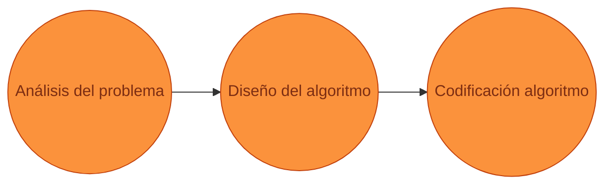
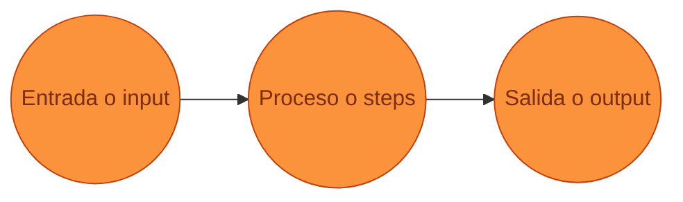

# Bienvenidos/as a Xcode Academy

## Introducción a la programación
### Nicolás Quiroz

---
layout: center
level: 1
title: Agenda
hideInToc: true
---

# Agenda

<Toc maxDepth=1 />

---
layout: section
level: 1
---

# Presentación

---
layout: two-cols
level: 1
title: Agenda
hideInToc: true
---

# ¿Quién soy?

- Nicolás Quiroz ([nicolasquirozpa@gmail.com](mailto:nicolasquirozpa@gmail.com))
- Ingeniero Civil Industrial en Computación e Ingeniería de Software, PUC (2019-2024)
  - Technical Lead en [Xpendit](https://xpendit.com/) 2024-Now
  - Senior Software Eng. en [Unholster](https://unholster.com/) 2023-2025
  - Ex Software Eng. en [NotCo](https://notco.com/) 2019-2023
- Fui coordinador del curso IIC1103 en la PUC por 2+ años
- Fui profesor del curso IIC1103 en la PUC por 1 semestre

::right::

<div class="block relative">

</div>

---
layout: center
level: 4
---

# Por qué hago estas clases

- Me gusta enseñar
- Creo que la programación es una habilidad muy útil
- Creo que todos pueden beneficiarse de aprender a programar

---
layout: center
level: 3
title: ¿Quiénes son ustedes?
hideInToc: true
---

# ¿Quiénes son ustedes?
## ¿Qué es lo que esperan de este curso?

---
layout: center
level: 2
---

# Cómo será el curso

---
layout: center
level: 3
---

# Cómo serán las clases

🔴 Programación en vivo, en las diapositivas.
**No recomiendo programar conmigo al mismo tiempo**

✅ **Altamente recomendado asistir**.

🏋🏼‍♂️ **Altamente recomendado** ejercitar los ejercicios de clase. Programar en su tiempo libre.

📜 **No habrán tareas**. Son clases particulares, no hay tareas, pero si hay ejercicios de clase.

---
layout: center
level: 2
hideInToc: true
---

# ¿ Preguntas hasta ahora ?

---
layout: section
level: 1
title: Introducción al curso
---
# Empecemos

---
layout: section
level: 2
title: Qué es la computación
---

# Qué es la computación
## Mythbusters

---
layout: center
level: 3
title: ¿Qué es la computación?
hideInToc: true
---

# ¿Qué es la computación?

---
layout: center
level: 3
title: ¿Qué es lo malo de la computación?
hideInToc: true
---

# ¿Qué es lo malo de la computación?

---
layout: center
level: 3
title: ¿Qué es la computación?
hideInToc: true
---

# ¿Es la computación diversa?

---
layout: default
level: 3
title: ¿Qué es la computación? - Mitos
hideInToc: true
---

# ¿Qué es la computación?
## Derribando mitos

La computación hoy en día se usa en todas partes 💻

<div class="flex flex-row space-x-4">
  
  
</div>

---
layout: default
level: 2
title: Objetivos del curso
---

# Objetivos del curso
## ¿Qué aprenderemos?

1. **Pensamiento algorítmico**: Descomponer problemas en pasos simples y secuenciales
2. **Programación**: Aprender a programar en Python (3) para resolver problemas

Aprenderemos un pensamiento que nos permitirá **resolver problemas de forma sistemática y programaremos en un nuevo lenguaje**, un lenguaje de programación que nos permitirá resolver problemas de forma sistemática.

---
layout: center
level: 2
title: Tips
---

# Tips para el curso

1. **No te quedes atrás**: Si no entiendes algo, pregunta, el curso es muy acumulativo. **PRACTICA**
2. **No memorices**: Entiende los conceptos, no los memorices. **PRACTICA**
3. **PRACTICA**, **PRACTICA**, **PRACTICA**

---
layout: center
level: 2
title: Dudas
hideInToc: true
---

# ¿Dudas?

---
layout: center
level: 1
title: Algoritmos
---

# Algoritmos

---
layout: section
level: 1
title: Calibración
---
# Calibración

¿Qué es un algoritmo?

¿Qué es un programa?

¿Qué es un lenguaje de programación?

¿Qué es software?

---
layout: center
level: 3
title: ¿Quiénes son ustedes?
hideInToc: true
---

# ¿Qué tanto saben programar?

---
layout: cover
level: 2
title: Motivación
hideInToc: false
clicks: 4
---
# Motivación
## ¿Por qué es necesario el pensamiento algorítmico?
### ¿Por qué es necesario pensar en pasos ordenados?

<ImgGrid :images="['content/clase_01/mess_kitchen.avif', 'content/clase_01/cau_cau.jpeg', 'content/clase_01/music.jpeg']" do-clicks class="w-full" v-click-hide="4"/>


---
layout: center
level: 3
title: ¿Qué beneficios tiene el pensamiento algorítmico?
hideInToc: true
---
# ¿Qué beneficios tiene el pensamiento algorítmico?


El pensamiento algorítmico es una herramienta que nos permite resolver problemas de manera ordenada y sistemática.

---
layout: center
level: 3
title: ¿Cómo se resuelve un problema?
hideInToc: true
---

# ¿Cómo se resuelve un problema?

Al final del día, muchos problemas pueden resolverse con un algoritmo.



<p class="ml-10 text-6xl">😖 -> &nbsp;🧑🏼‍💻 -> &nbsp; 🤩</p>

---
layout: section
level: 1
title: Qué es un algoritmo
hideInToc: false
---

# ¿Qué es un algoritmo?
## Y por qué es importante

---
layout: default
level: 2
title: Acerca de los algoritmos
hideInToc: false
---
# Acerca de los algoritmos

- Hay cursos enteros dedicados a este tema, como “Diseño y Análisis de Algoritmos”
- Nosotros nos enfocaremos en el pensamiento algorítmico, introduciendo conceptos básicos para poder resolver a la velocidad de la luz ⚡️
- Los algoritmos son una herramienta bastante estudiada que permiten dividir un problema en pasos ordenados más sencillos de abordar y ordenar.

---
layout: center
level: 2
title: Definición de algoritmo
hideInToc: false
---
# Definición de algoritmo

- Un algoritmo es un **conjunto de instrucciones o reglas definidas** y no ambiguas, **ordenadas y finitas** que permite **solucionar un problema**, realizar un cómputo, procesar datos y llevar a cabo otras tareas o actividades.

- Por ejemplo, para que **un computador** pueda realizar una suma, **debe seguir un algoritmo que le indique cómo hacerlo**.

- ¿ Qué algoritmos (además de los de un computador) se les ocurren de la vida diaria?

<div class="flex justify-center">
  <span class="text-6xl" v-click="1">🧑‍🍳</span>
  <span class="text-6xl" v-click="2">👷</span>
  <span class="text-6xl" v-click="3">🗺️</span>
  <span class="text-6xl" v-click="4">🪡</span>
</div>

---
layout: default
level: 2
title: Ejemplos de algoritmos
hideInToc: true
---
# Ejemplos de algoritmos

<ImgGrid :images="['content/clase_01/lego.jpeg', 'content/clase_01/musica.jpg', 'content/clase_01/terremoto.png']" do-clicks class="sm:100 md:w-300" v-click-hide="4"/>

---
layout: center
level: 2
title: Cómo programar un algoritmo
hideInToc: true
---

# Cómo programar un algoritmo
<div class="flex justify-center">

</div>

- Un computador al igual que un humano, necesita instrucciones para realizar una tarea. Y para ello es necesario _hablarle_.

- Para entregarle un algoritmo a un computador, es necesario utilizar un **lenguaje de programación**.

---
layout: statement
level: 2
title: Definicion
hideInToc: true
---

# Lenguaje de programación

Un lenguaje de programación es un **lenguaje formal** que especifica una serie de instrucciones para que una computadora produzca diversas clases de datos.

---
layout: section
level: 1
title: Cómo armar un algoritmo
hideInToc: false
---

# Cómo armar un algoritmo

---
layout: two-cols
level: 2
title: Proceso de creación de un algoritmo
---

# Proceso de creación de un algoritmo

Hay dos formas equivalentes de diagramar un algoritmo:

- A nivel de problema
- A nivel de computador

En este curso intentaremos siempre llevar los problemas a nivel de computador.

- **Entrada**: Recurso, dato(s) entrantes, que se necesitan para el algoritmo.
- **Proceso**: Pasos que debe seguir el algoritmo para resolver el problema.
- **Salida**: Resultado del algoritmo, que puede ser un dato o un recurso.

::right::

### A nivel de problema


### A nivel de computador



---
layout: center
level: 2
title: Ejemplo de algoritmo
hideInToc: true
---

# Ejemplo de algoritmo

<div class="flex justify-center">

</div>

- **Entrada**: Las letras del abecedario.
- **Proceso**: Por cada letra intentar una combinación de 5 letras. Repetir hasta que todas sean verdes.
- **Salida**: La combinación de letras que resultó en todas las letras verdes.

---
layout: center
level: 3
title: ¿Se les ocurre alguno?
hideInToc: true
---

# ¿Se les ocurre alguno?

---
layout: center
level: 2
title: Preguntas
hideInToc: true
---

# ¿Preguntas?

---
layout: section
level: 1
title: Ejercicios programación
hideInToc: false
---

# Ejercicios programación
## ¿Cómo programar un algoritmo?
### Primer acercamiento, programación en bloques

---
layout: center
level: 1
title: Salas SAP
hideInToc: true
---

# Cómo usar bloques


---
layout: center
level: 1
title: Actividad
hideInToc: true
---

# Actividad

Ingresar a [https://code.org/](https://code.org/) e ingresar con el código que se les entregará.

---
layout: two-cols
level: 2
title: Ejercicios
hideInToc: true
---

# Comencemos

- **Ejercicio 1**: <span v-click>¡Comiencen! (2 min).</span> <span v-click>Solución</span>
- **Ejercicio 2**: <span v-click>¡Comiencen! (2 min).</span> <span v-click>Solución</span>
- **Ejercicio 3**: <span v-click>¡Comiencen! (2 min).</span> <span v-click>Solución</span>
- **Ejercicio 4**: <span v-click>¡Comiencen! (2 min).</span> <span v-click>Solución</span>
- **Ejercicio 5**: <span v-click>¡Comiencen! (2 min).</span> <span v-click>Solución</span>
- **Ejercicio 6**: <span v-click>¡Comiencen! (2 min).</span> <span v-click>Solución</span>
- **Ejercicio 7**: <span v-click>¡Comiencen! (2 min).</span> <span v-click>Solución</span>
- **Ejercicio 8**: <span v-click>¡Comiencen! (2 min).</span> <span v-click>Solución</span>
- **Ejercicio 9**: <span v-click>¡Comiencen! (2 min).</span> <span v-click>Solución</span>

::right::

- **Ejercicio 10**: <span v-click>¡Comiencen! (5 min).</span> <span v-click>Solución</span>
- **Ejercicio 11**: <span v-click>¡Comiencen! (5 min).</span> <span v-click>Solución</span>
- **Ejercicio 12**: <span v-click>¡Comiencen! (5 min).</span> <span v-click>Solución</span>
- **Ejercicio 13**: <span v-click>¡Comiencen! (5 min).</span> <span v-click>Solución</span>
- **Ejercicio 14**: <span v-click>¡Comiencen! (5 min).</span> <span v-click>Solución</span>

---
layout: section
level: 1
title: A programar
hideInToc: true
---

# A programar
## Primeros pasos

---
layout: default
level: 2
title: Descargando un editor
hideInToc: true
---
# Descargando un editor

- Para programar, necesitamos un editor de código.
- Pueden descargar Thonny desde [https://thonny.org/](https://thonny.org/).


---
layout: default
level: 2
title: Hola mundo
hideInToc: false
---
# Hola Mundo <span class="text-white">👋🏻</span>

Podemos agregar comentarios en nuestro código para que sea más fácil de entender.

Los comentarios son líneas que comienzan con `#` y son ignoradas por el computador.

```python {monaco-run}
print("Hola mundo!") # Un saludo pal mundo
```

_Python_ es un un lenguaje interpretado, lo que significa que el código se ejecuta línea por línea.
Pueden probar correr el código en Thonny.

---
layout: section
level: 1
title: Tipos de datos básicos
hideInToc: false
---

# Tipos de datos básicos
## Números, textos y booleanos

---
layout: default
level: 2
title: Tipos de datos básicos
hideInToc: false
---

# Tipos de datos básicos

En la computación —y particularmente en Python— existen distintos tipos de datos básicos, que son agrupables en tres categorías:

<span class="like-h3">Números</span>

- **`int`**: Números enteros (viene de _integer_). Por ejemplo: `1`, `2`, `3`.
- **`float`**: Números con decimales (viene de _floating point_). Por ejemplo: `1.0`, `2.5`, `3.1415`. ⚠️ **Ojo** con los decimales, en Python se usan `.` y no `,` como en español.
- **`complex`**: Números complejos. Por ejemplo: `1+2j`. **Este no lo usaremos acá**.

<span class="like-h3">Textos</span>

- **`str`**: Textos (viene de _string_). Por ejemplo: `"Hola mundo"`, `"Xpendit"`, `"👋🏻"`.

<span class="like-h3">Booleanos</span>

- **`bool`**: Booleanos (viene de _boolean_). Puede ser `True` o `False`.

---
layout: section
level: 1
title: Operaciones básicas
hideInToc: false
---

# Operaciones básicas
## Suma, resta, multiplicación, división y más

---
layout: default
level: 2
title: Operaciones básicas - numéricas
hideInToc: false
---

# Operaciones básicas

En Python podemos realizar operaciones básicas con los tipos de datos básicos. Estos se pueden hacer con números o textos (veremos textos más adelante).

<!-- Tabla con todas las operaciones simples (suma, resta, multiplicación, potencia, inverso aditivo, división normal, parte entera y resto o modulo).Mostrar el operador y una descripción. Mostrar un ejemplo y su resultado como columnas tambien -->

| Operación | Descripción | Ejemplo | Resultado |
| --------- | ----------- | ------- | --------- |
| `+` | Suma | `1 + 2` | `3` |
| `-` | Resta | `1 - 2` | `-1` |
| `*` | Multiplicación | `2 * 3` | `6` |
| `/` | División | `3 / 2` | `1.5` |

---
layout: default
level: 2
title: Operaciones básicas - numéricas continuación
hideInToc: true
---
También hay operaciones más complejas, que se pueden hacer con números.

| Operación | Descripción | Ejemplo | Resultado |
| --------- | ----------- | ------- | --------- |
| `**` | Potencia | `2 ** 3` | `8` |
| `//` | División entera | `3 // 2` | `1` |
| `%` | Módulo | `3 % 2` | `1` |
| `-` | Inverso aditivo | `-1` | `-1` |

---
layout: default
level: 2
title: Operaciones básicas - división parte entera
hideInToc: true
---

# División parte entera

La división parte entera se pueden hacer con números enteros (`int`) y con decimales (`float`).

En la división normal, el resultado es un número con decimales (`float`).

```python
>>> print(3 / 2)
1.5
```

En la división parte entera, el resultado es un número entero (`int`), que corresponde a la parte entera del resultado de la división normal.

```python
>>> print(3 // 2)
1
```

👀 **Ojo**: La división parte entera **no** redondea el resultado, solo entrega la parte entera.

👀 **Ojo**: Si alguno de los dos números es un `float`, el resultado será un `float`.

```python
>>> print(3.0 // 2)
1.0
```

---
layout: default
level: 2
title: Operaciones básicas - módulo
hideInToc: true
---

# Módulo (resto)

El módulo se pueden hacer con números enteros (`int`) y con decimales (`float`). El resultado es simplemente el resto de la división si fuera entera.

```python
>>> print(3 % 2)
1
```

👀 **Ojo**: Si alguno de los dos números es un `float`, el resultado será un `float`.

```python
>>> print(3.0 % 2)
1.0
```
<!-- Examples slides from the above-->

---
layout: default
level: 2
title: Operaciones básicas - ejemplos
hideInToc: true
---

# Operaciones básicas
## Ejemplos con números
<v-clicks>
Fui a comprar un almuerzo al hall y compré una bebida ($1000), un sándwich ($3000) y un helado ($1200). ¿Cuánto gasté?

```python
print(1000 + 3000 + 1200) # Esto imprime 5200
```

Fui a una fonda, y me comí 3 empanadas de pino ($1500 c/u). Pero una de ellas me la regalaron. Me cobraron un 10% de propina. ¿Cuánto gasté?

```python
print(3 * 1500 - 1 * 1500) # Esto imprime 3000
print(3000 * 1.1) # Esto imprime 3300
```

Cuantos billetes de $1000 necesito para pagar lo anterior? ¿Cuánto me faltaría?

```python
print(3300 // 1000) # Esto imprime 3
print(3300 % 1000) # Esto imprime 300
```

</v-clicks>

ℹ️ Es posible imprimir el resultado de una operación directamente en la consola, usando el `print`.

---
layout: default
level: 2
title: Operaciones básicas - ejemplos (cont.)
hideInToc: true
---

# Operaciones básicas
## Ejemplos con números (cont.)

```python {monaco-run}
# Cómo determinar si un número es par
print(4 % 2 == 0)
print(5 % 2 == 0)

# Pregunta: Por qué arriba retorna booleanos? (True o False)

# Propuesto: retornar 0 si es impar, 1 si es par
```

---
layout: section
level: 2
title: Operaciones básicas - booleanos
hideInToc: false
---
# Operaciones básicas
## Booleanos

---
layout: default
level: 2
title: Operaciones básicas - booleanos
hideInToc: true
---

# Operaciones básicas - booleanos

En Python podemos realizar comparaciones entre números y textos —y otras cosas—, y el resultado será un booleano, que es simplemente `True`(verdadero) o `False` (falso). Algunos ejemplos son:

| Operación | Descripción | Ejemplo | Resultado |
| --------- | ----------- | ------- | --------- |
| `==` | Igual | `1 == 2` o `"hola" == "chao"` | `False` |
| `!=` | Distinto | `1 != 2` o `"dormir" != "siesta"` | `True` |
| `<` | Menor que | `1 < 2` | `True` |
| `>` | Mayor que | `1 > 2` | `False` |
| `>=` | Mayor o igual que | `1 >= 2` | `False` |
| `<=` | Menor o igual que | `1 <= 2` | `True` |

---
layout: default
level: 2
title: Operaciones básicas - booleanos (cont.)
hideInToc: true
---

# Operaciones básicas
## Booleanos

🚨 Notar que los ejemplos que hicimos fueron con números y textos, pero también se pueden hacer con otros tipos de datos, como por ejemplo con booleanos (y otros que veremos más adelante)

### Operadores de booleanos

Además, existe una forma de juntar booleanos, que son los operadores booleanos. Estos son:

| Operación | Descripción | Ejemplo | Resultado |
| --------- | ----------- | ------- | --------- |
| `and` | Y | `True and False` | `False` |
| `or` | O | `True or False` | `True` |
| `not` | Negación (No) | `not True` | `False` |

ℹ️ **Nota**: Los operadores tienen precedencia, y se pueden agrupar con paréntesis (ahora lo veremos).

---
layout: default
level: 3
title: Operaciones básicas - booleanos - ejemplos
hideInToc: true
---
# Operaciones básicas
## Booleanos - Ejemplos

Veamos algunos ejemplos de operaciones, con distintos tipos de datos.

```python

# Algo no verdadero es falso
print(not True) # False

# Mi edad en 2 años más será más que 30 (que terrible)
print(28 + 2 > 30) # True

# Mi nombre (Nicolás) no es "Roberto". Veremos comparaciones de strings más adelante
print("Nicolás" != "Roberto") # True

# Mi nombre (Nicolás) no es "Roberto" y mi edad en 2 años más será más que 30.
# Veremos comparaciones de strings más adelante en las diapositivas de strings
print("Nicolás" != "Roberto" and 28 + 2 > 30) # True

```

---
layout: section
level: 2
title: Operaciones básicas - strings
hideInToc: false
---
# Operaciones básicas
## Strings

---
layout: default
level: 2
title: Operaciones básicas - strings
hideInToc: true
---

# Operaciones básicas
## Strings

Los textos o strings también pueden ser operados, pero de una forma distinta a los números. Algunos ejemplos de operaciones son:

| Operación | Descripción | Ejemplo | Resultado |
| --------- | ----------- | ------- | --------- |
| `+` | Concatenación | `"Sa" + "shei!"` | `"Sashei!"` |
| `*` | Repetición | `"Le!"` * 3 | `"Le!Le!Le!"` |

La resta, división, etc. no están definidas para los strings.

---
layout: default
level: 2
title: Operaciones básicas - strings (cont.)
hideInToc: true
---

Y es posible compararlos también:

| Operación | Descripción | Ejemplo | Resultado |
| --------- | ----------- | ------- | --------- |
| `==` | Igual | `"mi tarea" == "mi tarea"` | `True` |
| `!=` | Distinto | `"mi tarea" != "tu tarea"` | `True` |

❓ ¿Qué pasa si comparamos dos strings con `>` o `<`?
<v-click>

> **Respuesta**: Se comparan alfabéticamente, es decir, si el primer string es alfabéticamente mayor que el segundo, el resultado es `True`, y si no, es `False`.
> **No es necesario que sepan esto pero puede serles útil**
</v-click>

❓ ¿Qué pasa si comparamos un string con un número? (i.e. `"1" == 1`)

<v-click>

> **Respuesta**: El resultado siempre será `False`, ya que son tipos de datos distintos.
</v-click>

---
layout: default
level: 3
title: Operaciones básicas - strings - ejemplos
hideInToc: true
---
# Operaciones básicas
## Strings - Ejemplos

```python
# Concatenación
print("A mi me gusta el" + "tangananica") # Esto imprime "A mi me gusta eltangananica" <- falto un espacio

# Repetición
print("Tangana"+ "nica" * 3) # Esto imprime "Tangananicanicanica"

# Comparación
print("Tangananica" == "Tanganana") # Esto imprime False
print("Tangananica" != "Tanganana") # Esto imprime True

# Comparación alfabética
print("Yo nunca vi television" > "Porque es muy fome") # Esto imprime True
print("Yo preferia" < "Estudiar y hasta leer") # Esto imprime False
```

🚨 Notar que las mayúsculas y minúsculas son distintas, por lo que `"Hola" != "hola"` y al comparar alfabéticamente, las mayúsculas son "menores" que las minúsculas.

Tulio triviño estaría orgulloso de ustedes.

---
layout: section
level: 1
title: Precedencia de operadores
hideInToc: false
---

# Precedencia de operadores
## ¿Qué operación se hace primero?

---
layout: default
level: 2
title: Precedencia de operadores
hideInToc: true
---

# Precedencia de operadores

<div class="w-ful -m-2">
  
</div>

✅ En vez de memorizar la tabla, es mejor usar paréntesis para agrupar las operaciones.

---
layout: default
level: 2
title: Uso de paréntesis
hideInToc: true
---

# Uso de paréntesis

Usar paréntesis es una buena práctica para agrupar operaciones y hacer más legible el código.

```python
>>> print(1 + 2 * 3)
7
>>> print((1 + 2) * 3)
9
```

Y se puede usar con operaciones más complejas

```python
# La edad que tenía hace 5 años, sumado a tres veces la edad que tendré en 5 años, es mayor que 100
>>> print((26 - 5) + 3 * (26 + 5) > 100)
True
```

Y se puede usar con operadores lógicos y strings

```python
>>> print(("que gran" + " " + "onda chiqui!") == ("que gran onda chiqui!")) # Suuuuuave
True
>>> print(("que gran" + " " + "onda chiqui!") == ("que gran" + "onda chiqui!"))
False
```

---
layout: center
level: 2
title: Nemo
hideInToc: true
---


---
layout: center
level: 2
title: Contexto Ejercicio Propuesto
hideInToc: true
---

# Contexto Ejercicio Propuesto

[https://www.youtube.com/embed/SLM0S1rC0cE](https://www.youtube.com/embed/SLM0S1rC0cE)

---
layout: default
level: 1
title: Ejercicio avanzado
hideInToc: true
---
# Ejercicio propuesto

Estás organizando una fondita para el 18 de septiembre. Decides escribir un mensaje secreto para tus amigos utilizando empanadas ("E"), choripanes ("P"), bebidas ("B") y banderas chilenas ("C") como forma de codificar la información.

Por cada amigo que invites, enviarás un mensaje que consiste en:

- 3 empanadas seguidas de 2 choripanes.
- Luego, por cada 4 amigos, agregarás una bebida al final del mensaje.
- Si el número de amigos es par, añadirás una bandera chilena al inicio del mensaje. Si es impar, la añadirás al final.

---
layout: default
level: 2
title: Algunos intentos
hideInToc: true
---

# Algunos intentos

<v-clicks>

```python
print('CEEEPPEEEPPEEEPPEEEPPEEEPPEEEPPEEEPPEEEPPEEEPPEEEPPEEEPPEEEPPEEEPPEEEPPBBB')
```

Razón: _Hardcodear_ el mensaje no es una buena idea, ya que si cambia el número de amigos, el mensaje no funcionará.

```python
print('C' * 1 + 'EEEPP' * 14 + 'B' * 3)
```

Razón: No considera el caso de que el número de amigos sea par o impar.

</v-clicks>

---
layout: default
level: 2
title: Solución ejercicio propuesto clase anterior
hideInToc: true
---

# Solución

```python
print("C" * (1 - (14 % 2)) + "EEEPP" * 14 + "B" * (14 // 4) + "C" * (14 % 2))
```

Si el número de amigos es 14, el mensaje se verá así:

```text
CEEEPPEEEPPEEEPPEEEPPEEEPPEEEPPEEEPPEEEPPEEEPPEEEPPEEEPPEEEPPEEEPPEEEPPBBB
```

Si el número de amigos es 13, el mensaje se verá así:

```text
EEEPPEEEPPEEEPPEEEPPEEEPPEEEPPEEEPPEEEPPEEEPPEEEPPEEEPPEEEPPEEEPPBBBC
```

```python
print("C" * (1 - (13 % 2)) + "EEEPP" * 13 + "B" * (13 // 4) + "C" * (13 % 2))
```

---
layout: section
level: 1
title: Variables
hideInToc: false
---

# Variables
## ¿Qué son y para qué sirven?

---
layout: center
level: 2
title: Motivación
hideInToc: true
---
# Motivación
Habrán notado que en el ejercicio anterior, tuvimos que repetir varias veces el número de amigos que teníamos. Esto es un poco tedioso, y además, si cambia el número de amigos, tenemos que cambiarlo en todos lados.

<v-click>

**¿Cómo podemos solucionar esto?**
</v-click>

<v-click>

## 🤩 ¡ Con variables ! 🤩
</v-click>

---
layout: fact
level: 2
title: Definición de variables
hideInToc: false
---

# Variables

Una variable nos permite guardar información o valores, que pueden ser referenciados más adelante en el código.

---
layout: fact
level: 2
title: Demostración
hideInToc: true
---

# Demostración

---
layout: default
level: 2
title: Definición de variables
hideInToc: true
---

# Definición de variables

Pueden pensar en una variable como una caja, que tiene un nombre y un contenido. El nombre de la variable es como la etiqueta de la caja, y el contenido es lo que está dentro de la caja.

🧠 Le da un contexto más semántico al programa. Es decir, podemos entenderlo mejor.

Mejores variables -> mejores programas

Por ejemplo:

```python
print(5 * 10 / 2) # Sacar el area de un triangulo de base 5 y altura 10
```

No es lo mismo que

```python
base = 5
altura = 10
area = base * altura / 2
print(area)
```

💡 **En las variables, podemos guardar valores, y resultados de operaciones.**

---
layout: default
level: 2
title: Variables - ejemplos
hideInToc: true
---

# Variables - ejemplos

En la solución anterior, tuvimos que usar el número de amigos directamente en el código.

Ahora, esto sería mucho más fácil de entender si usamos variables:

```python
amigos = 14
bebidas = amigos // 4
print("C" * (1 - (amigos % 2)) + "EEEPP" * amigos + "B" * bebidas + "C" * (amigos % 2))
```

Pregunta, y que pasa si quiero dejar que el usuario ingrese el número de amigos?

---
layout: section
level: 1
title: Input y output (I/O)
hideInToc: false
---

# Input y output (I/O)
## Recibir y entregar información al usuario

---
layout: default
level: 2
title: Input — pedir información
hideInToc: true
---

# Input
## Pedir información

Hasta el momento fijado lo que necesitamos, pero ¿y si queremos que nos entreguen información?

👉🏻 **`input()`** es la función que nos permite pedir información al usuario.

```python
nombre = input()
print("Hola", nombre)
```

`input()` siempre retorna un `str`, por lo que si queremos un número, debemos convertirlo.

```python
edad = int(input())
print("El próximo año tendrás", edad + 1)

# Con float también funciona
altura = float(input())
print("Tu altura es", altura)
```

💡 Notar que guardamos el resultado de `input()` en una variable, para poder usarlo después.

💡 Notar que el `print()` puede separar los argumentos con `,` y los imprime separados por un espacio.

---
layout: section
level: 1
title: Variables
hideInToc: false
---

# Variables
## Almacenar información

---
layout: default
level: 2
title: Variables - continuación
hideInToc: false
---

# Variables
## Almacenar información

- Las variables nos sirven para almacenar información.
- Pueden tomar cualquier valor, y podemos ponerle el nombre que queramos, con algunas restricciones:

  - No pueden empezar con un número.
  - No pueden tener espacios.
  - No pueden tener caracteres especiales (excepto `_`).
  - No pueden ser palabras reservadas:
    - `and`, `as`, `assert`, `break`, `class`, `continue`, `def`, `del`, `elif`, `else`, `except`, `False`, `finally`, `for`, `from`, `global`, `if`, `import`, `in`, `is`, `lambda`, `None`, `nonlocal`, `not`, `or`, `pass`, `raise`, `return`, `True`, `try`, `while`, `with`, `yield`
    - Para ver la lista completa ir a [https://docs.python.org/3/reference/lexical_analysis.html#keywords](https://docs.python.org/3/reference/lexical_analysis.html#keywords)

---
layout: default
level: 2
title: Variables - que se puede hacer con ellas
hideInToc: false
---

# Variables
## Que se puede hacer con ellas

- Podemos guardar cualquier tipo de dato en una variable y podemos cambiarlo.
- Podemos usar el valor de una variable para calcular otro valor.
- Podemos usar el valor anterior de una variable para calcular su nuevo valor.

```python
# Podemos actualizar el valor de una variable
nombre = "Nico"
print("Mucho gusto", nombre)
nombre = "Juan"
print("Mucho gusto", nombre)

# Podemos usar el valor de una variable para calcular su nuevo valor u otro valor
edad = 20
print("El próximo año tendrás", edad + 1)
edad = edad + 1
print("El próximo año tendrás", edad)
altura = 1.8
peso = 80
imc = peso / altura ** 2
print("Tu IMC es", imc)
```

---
layout: default
level: 2
title: Variables - operadores compuestos
hideInToc: false
---

# Variables
## Operadores de asignación compuestos

❗ Usar `=` no es lo mismo que usar `==`.
> `=` es para asignar un valor a una variable. `==` es para comparar dos valores.

La operación tipo `edad = edad + 1` es muy común, por lo que existe una forma más corta de escribirla:

```python
edad = 20
edad += 1
print("El próximo año tendrás", edad)
```

💡 Esto es equivalente a `edad = edad + 1`. Esto funciona con todos los operadores aritméticos.

---
layout: center
level: 2
title: Tabla de operadores compuestos
hideInToc: true
---

# Tabla de operadores compuestos

| Operador | Ejemplo | Equivalente |
| -------- | ------- | ----------- |
| `+=`     | `a += b` | `a = a + b` |
| `-=`     | `a -= b` | `a = a - b` |
| `*=`     | `a *= b` | `a = a * b` |
| `/=`     | `a /= b` | `a = a / b` |
| `**=`    | `a **= b` | `a = a ** b` |
| `//=`    | `a //= b` | `a = a // b` |
| `%=`     | `a %= b` | `a = a % b` |

---
layout: default
level: 2
title: Variables - participación
hideInToc: false
---

# Variables
## Participación

¿Cómo hacemos el siguiente programa?

```text
Dime un numero
5
Te gano con el numero 6
```

<v-click>

```python
numero = int(input())
print("Te gano con el numero", numero + 1)
```

</v-click>

---
layout: default
level: 2
title: Variables - ejemplos
hideInToc: false
---

# Variables - ejemplos

Eres un pescador en el juego "Ocean's Call", un popular juego de pesca online. Tienes un barco, una caña de pescar y una serie de cebos que puedes usar para atrapar diferentes tipos de peces.
Hay tres tipos de peces (10, 20 y 30 kg) y cada uno tiene un valor en monedas de oro (50, 100, 150 respectivamente), además de bonificaciones especiales por atrapar ciertos tipos de peces.

1. **Barco**: Tu barco tiene un límite de capacidad de 180 kg. Cada vez que atrapas un pez, debes restar su peso de la capacidad total.

2. **Caña de pescar**: Tu caña de pescar tiene una resistencia de 15 kg. Por cada pez que atrapes, debes restar un 10% de su peso de la resistencia total. Si la resistencia de la caña de pescar llega a 0, se romperá y tendrás que comprar una nueva al final del día.

3. **Cebos**: Tienes 2 tipos de cebos que puedes usar:
   - Cebo brillante (representado por el número 1): Si usas este cebo y atrapas peces de 20kg, recibirás una bonificación de 500 monedas de oro por cada pez de 20kg.
   - Cebo mágico (representado por el número 0): Si usas este cebo y atrapas peces de 30kg, recibirás una bonificación de 1000 monedas de oro por cada pez de 30kg.

---
layout: default
level: 2
title: Variables - ejemplos - continuación
hideInToc: true
---
# Variables - ejemplos

## Objetivo

Escribe un programa que reciba 4 entradas:

1. Las primeras tres serán enteros que determinan la cantidad de peces que pescarás de 10 kg, 20 kg y 30 kg.
2. La cuarta entrada será un entero que determina el tipo de cebo que usarás para todos ellos (1 para cebo brillante y 0 para cebo mágico).

El programa deberá imprimir:

- Cuánto oro ganarás en total.
- Si necesitas comprar una nueva caña de pescar (True si se rompe, False si no) al final del día.
- Cuánta capacidad te queda en el barco.

---
layout: default
level: 2
title: Variables - ejemplos - continuación
hideInToc: true
---

**Ejemplo**:

Entradas:

```python
5
3
2
1
```

Salida:

```text
Oro total ganado: 2350
¿Necesitas comprar una nueva caña de pescar? True
Capacidad restante en el barco: 10 kg
```

Explicación: El usuario decide pescar 5 peces de 10 kg, 3 peces de 20 kg y 2 peces de 30 kg, y usa cebos brillantes para todos ellos.
Por lo tanto, gana 2350 monedas de oro en total, necesita comprar una nueva caña de pescar porque la resistencia de la caña de pescar llega a 17kg lo que es superior a 15kg, y le queda 10 kg de capacidad en el barco.

---
layout: default
level: 2
title: Variables - ejemplos - solución
hideInToc: true
---

# Variables - ejemplos
## Solución

```python {1-10|12-15|17-22|24-29|31-36}{lines:true, maxHeight: '25vh'} {monaco-run}
# Entradas del usuario
peces_10kg = int(input())
peces_20kg = int(input())
peces_30kg = int(input())
tipo_cebo = int(input())

# Variables iniciales
capacidad_barco = 180
resistencia_caña = 15
oro = 0

# Pesca de peces de 10 kg
capacidad_barco -= 10 * peces_10kg
oro += peces_10kg * 50
resistencia_caña -= peces_10kg * 10 * 0.1

# Pesca de peces de 20 kg
capacidad_barco -= 20 * peces_20kg
oro += peces_20kg * 100
resistencia_caña -= peces_20kg * 20 * 0.1
bono_20kg = 500 * tipo_cebo
oro += bono_20kg * peces_20kg

# Pesca de peces de 30 kg
capacidad_barco -= 30 * peces_30kg
oro += peces_30kg * 150
resistencia_caña -= peces_30kg * 30 * 0.1
bono_30kg = 1000 * (1 - tipo_cebo)
oro += bono_30kg * peces_30kg

# Verificar si la caña se rompe
caña_rota = resistencia_caña <= 0

print("Oro total ganado:", oro)
print("¿Necesitas comprar una nueva caña de pescar?", caña_rota)
print("Capacidad restante en el barco:", capacidad_barco, "kg")
```

---
layout: end
level: 1
title: Fin de la clase
hideInToc: true
---

# ¡Nos vemos en la próxima clase!
**Traigan Computador 💻**

---
layout: end
level: 1
title: Créditos
hideInToc: true
---

# Créditos

Esta clase fue preparada con el apoyo de Valeria Herskovic, Jorge Muñoz, Cristian Ruz, Nicolás Alvarado y José Tomás Marquinez

<div class="mx-auto flex pt-2 px-2 pb-1 -space-x-2 overflow-hidden">
    
    
    
    
    
</div>

¡Muchas gracias a todos/as!
